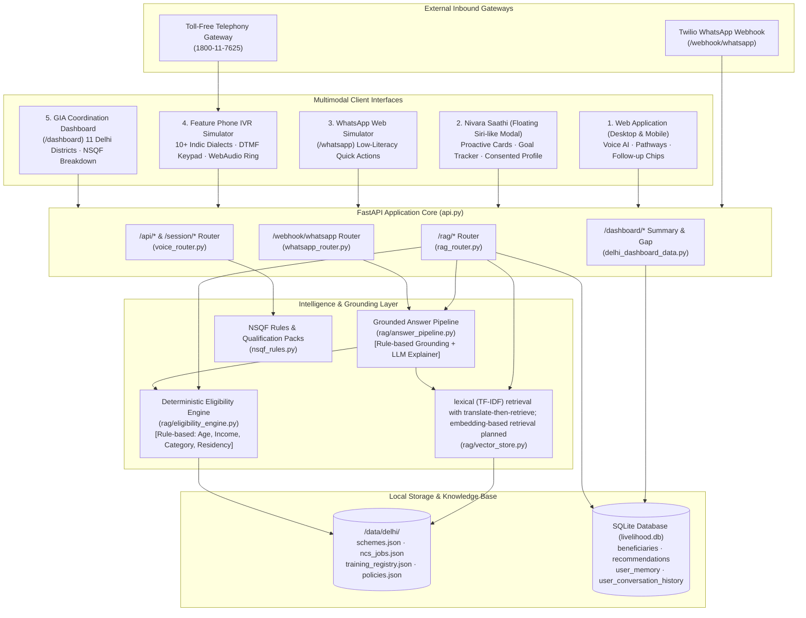

# Nivara Architecture — PM-AJAY GIA Skilling & Livelihood Engine

Nivara is an AI-powered voice assistant and regional coordination platform for livelihood mapping and NSQF-aligned skilling for Scheduled Caste (SC) communities under the **PM-AJAY (Grants-in-Aid component)**, Ministry of Social Justice and Empowerment (MoSJE), Government of India.

---

## 1. System Architecture Overview



---

## 2. Component Breakdown

### A. Delhi Knowledge Base (`/data/delhi/`)
All knowledge data is strictly scoped to the **National Capital Territory of Delhi**, driven by `region = "delhi"` (region-configurable for future state rollouts):
1. **`schemes.json`**: 18 central and Delhi state-level welfare and skilling schemes for SC beneficiaries (PM-AJAY GIA, DSFDC Concessional Loans, Stand-Up India, Post-Matric Scholarship, PMKVY 4.0 Special Projects, DSEU Certificate Courses, NSFDC). Every scheme includes machine-readable validation criteria:
   - `min_age`, `max_age`, `income_limit`, `category` (SC mandatory), `education`, `gender`, `residency`
   - Official URLs, helpline contacts, and physical district offices across Delhi.
2. **`ncs_jobs.json`**: 32 sample NCS-style job roles aligned with NSQF Qualification Packs (QPs), sectors, required competencies, average monthly wage ranges (₹14,000–₹38,000), and Delhi hiring clusters (Okhla, Mayur Vihar, Bawana, Naraina, Pusa).
3. **`training_registry.json`**: 22 accredited Delhi training centres (Govt ITIs, Jan Shikshan Sansthan, PMKK, DSEU Campuses) covering all 11 Delhi revenue districts with course codes, NSQF levels, duration, and contacts.
4. **`policies.json`**: Curated statutory policies (PM-AJAY GIA guidelines, National Credit Framework, Delhi SC Welfare Policy, Apprenticeship Act, National Policy on Skill Development).

### B. Deterministic Eligibility Engine (`rag/eligibility_engine.py`)
- **Global Invariant:** The LLM is **NEVER** permitted to evaluate or decide eligibility.
- Evaluates raw profile fields (`age`, `annual_income`, `caste_category`, `education`, `gender`, `is_delhi_resident`) against scheme criteria in Python code.
- Returns a deterministic structure:
  ```json
  {
    "eligible": true,
    "unmet_criteria": [],
    "missing_documents": ["Caste Certificate", "Income Certificate from Tehsildar"]
  }
  ```
- The LLM only synthesizes and explains the deterministic result with official citations.

### C. Offline-Ready Local Retrieval Engine (`rag/vector_store.py`)
- **Retrieval Architecture:** Lexical (TF-IDF) retrieval with translate-then-retrieve; embedding-based retrieval planned.
- Built using **TF-IDF subword char/word n-gram vectorization** with Cosine Similarity.
- **Cross-Language Normalization:** Translates Indic queries (Hindi, Tamil, Telugu, Punjabi, etc.) to English via cached LLM call or offline 60-term glossary fallback (`data/glossary/intent_terms.json`) before computing TF-IDF similarity against English KB documents.
- **Zero-Dependency & Offline-First:** Does not require Chroma/FAISS network downloads or external embedding API keys; sub-millisecond retrieval latency (<1ms).
- Indexes all schemes, jobs, training centres, policies, and district welfare offices with sub-field metadata.

### D. Per-User Memory Store (`rag/memory_store.py`)
- SQLite-backed tables:
  - `user_memory`: Structured profile (age, gender, district, income, education, skills, stated goal), active consented status.
  - `user_conversation_history`: Turn-by-turn conversation logs and episodic summaries.
  - `user_applications`: Saved schemes, roadmap milestones, application progress tracking.
- Implements full **Consent & Right-to-be-Forgotten** (`DELETE /rag/memory/{user_id}`).

### E. Grounded Answer Pipeline (`rag/answer_pipeline.py`)
- Tri-stage execution:
  1. Retrieve top-k knowledge snippets using lexical (TF-IDF) retrieval with translate-then-retrieve; embedding-based retrieval planned.
  2. Run the deterministic eligibility engine if profile information is present.
  3. Synthesize grounded answer with verified official links, helplines, and application steps.
- Safe deterministic fallback ensures that even under LLM rate limits (HTTP 429), grounded answers are never blocked.

### F. Nivara Saathi Personal Assistant (`static/saathi_assistant.js`)
- Fullscreen Siri-like conversational assistant accessible from any screen via floating button.
- Proactive cards: Daily Next Best Step, Stated Goal Progress Tracker, Deadline Reminders, Suggested Schemes on profile update.
- Consented Onboarding with full "View / Edit / Delete My Data" controls.
- Voice-first with wake mic button and synchronized TTS audio playback.

### G. WhatsApp Integration & Simulator (`whatsapp_service.py`, `static/whatsapp_sim.html`)
- Dual-channel integration:
  1. `/webhook/whatsapp` backend endpoint: **Sandbox-ready** for Twilio WhatsApp sandbox (`whatsapp:+14155238886`) with HMAC signature validation (returns TwiML XML).
  2. `/whatsapp` in-app authentic simulator allowing instant browser testing without Twilio credentials.
- Low-literacy menu shortcuts:
  - `1`: SC Schemes
  - `2`: Training Centres
  - `3`: Check My Eligibility
  - `4`: Reminders & Progress
  - `0`: Main Menu

### H. Rebuilt GIA Dashboard (`static/dashboard.html`)
- Unified visual design using shared tokens (`static/theme.css`, Tailwind CSS, Inter & Plus Jakarta Sans typography).
- Scoped to **Delhi 11 Districts**: Central Delhi, East Delhi, New Delhi, North Delhi, North East Delhi, North West Delhi, Shahdara, South Delhi, South East Delhi, South West Delhi, West Delhi.
- Live data components:
  - Total beneficiaries mapped (1,184) and target progress.
  - Skilling enrolments by NSQF Level (NSQF 3: 32.3%, NSQF 4: 46.5%, NSQF 5: 15.8%, NSQF 6: 5.4%).
  - Scheme uptake & grant utilization across PM-AJAY GIA, DSFDC, Stand-Up India, PMKVY, Post-Matric SC, DSEU.
  - 11-District coverage table with 1-click district filtering.
  - Actionable pending applications queue with modal review actions (`POST /dashboard/applications/{id}/action`).
  - Administrative alerts panel with instant resolution triggers.

### I. 10+ Language IVR System (`static/app.js`, `#viewIvr`)
- Interactive feature phone simulator supporting **11 Indic Languages**: Hindi, English, Punjabi, Urdu, Bengali, Tamil, Telugu, Marathi, Gujarati, Kannada, Malayalam.
- Realistic audio synthesis via Web Audio API:
  - DTMF dual-tone multi-frequency generator (`697Hz–1477Hz`).
  - Simulated 400Hz Indian ring tone and analog telephone line static noise.
- Multi-tier menu tree:
  - Level 0: Language Selection (`1..9, 0, #`)
  - Level 1: Main Menu (`1`=Schemes, `2`=Centres, `3`=AI Voice Assistant, `9`=Repeat, `*`=Back)
  - Level 2: Submenus with live RAG retrieval, speech synthesis, and simulated SMS dispatch.
- Side-by-side live event transcript stream with operator diagnostics and SMS preview slip.

---

## 3. Works vs. Mocked & Honest Capability Matrix

| Component | Current Implementation Status | Honest Labelling & Planned Roadmap |
|---|---|---|
| **Voice Input (ASR)** | **browser Web Speech API (Chrome recommended, internet required); Indic accuracy varies; Bhashini/Whisper planned** | Uses browser `webkitSpeechRecognition`. High accuracy on English/Hindi under clear audio; varying accuracy across regional dialects; live MeitY Bhashini ASR and on-device Whisper models planned. |
| **Voice Output (TTS)** | **Multi-tier hybrid: Edge-TTS / Web Speech API** | Server-side neural TTS via `edge-tts` with fallback to browser `SpeechSynthesis`. Live Bhashini Dhruva TTS planned for official deployment. |
| **Knowledge Base Retrieval** | **lexical (TF-IDF) retrieval with translate-then-retrieve; embedding-based retrieval planned** | Uses subword char/word n-gram TF-IDF vectorizer + Cosine Similarity. Cross-lingual queries normalized via cached LLM translation or 60-term glossary term substitution. Dense embedding retrieval (e.g. IndicBERT / BGE-M3) planned. |
| **Eligibility Determination** | **100% Deterministic Python Rules Engine** | Fully evaluated by rule engine in `rag/eligibility_engine.py` (age, income, SC caste category, residency). LLM is strictly prohibited from deciding eligibility. |
| **Data Verification** | **Unverified sample data (`verification_status="unverified"`)** | All 18 schemes, 22 training centres, and 6 policies are marked unverified with `last_verified=null`. Human departmental review required using `reports/kb_review_checklist.md`. Badges in UI state: *"Sample data - verify on official site"*. |
| **WhatsApp Integration** | **Sandbox-ready** | Backend webhook `/webhook/whatsapp` is sandbox-ready for Twilio WhatsApp sandbox (`whatsapp:+14155238886`) with HMAC `X-Twilio-Signature` validation. Live production WhatsApp Business API account planned. |
| **Feature Phone IVR** | **Browser Web Audio Simulator** | Simulates 2G feature phone with Web Audio API DTMF generator and call state machine. Production telecom PRI line / SIP trunk (Asterisk/KooKoo) planned. |
| **GIA Admin Dashboard** | **Fully functional UI with sample regional registry** | Real-time district filtering, Chart.js graphs, application review actions, and capacity gap reports based on Delhi sample database. |
